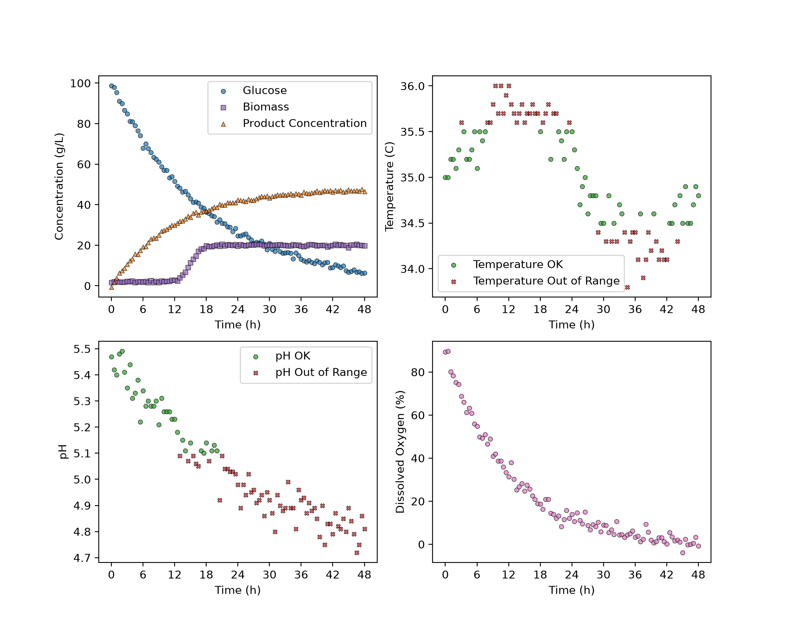

# Bio-fermentation Monitoring: Temperature and pH Optimization
### A Python-based monitoring tool , that evaluates the pH and temperature conditions across multiple batches in a data set and summarizes the process performance. 
## Overview
The goal of this project was to monitor fermentation batches and determine if important process conditions stay within acceptable ranges through the use of Python software. The code automatically separates the fermentation dataset and converts key process variables, such as pH, temperature, dissolved oxygen, glucose, biomass, and product concentration, into easily comprehensible tables and figures. It identifies whether the samples taken from the batches at different time intervals fall within the specified pH and temperature ranges. The dataset is evaluated in two operating modes with different acceptable ranges to demonstrate how the results can change under different operating conditions. The displays are plotted versus time, using 6-hour intervals, while the summary tables provide information on the operating range performance and final product concentration.   

## Features
### Batch Extraction
This program separates the fermentation dataset into individual batches, which allows for independent evaluation of each batch and identifies the total number in the data set. 
### pH and Temperature Monitoring 
The pH and the temperature levels are monitored to determine if they fall within the specified acceptable operating ranges. The software then generates a visual dashboard displaying the pH and temperature levels over time.  
### Batch Performance Summary 
The software calculates the percentage measurements within the acceptable pH and temperature limits for each batch. It then reports the final concentration for each batch and saves the results in CSV summary tables.

## Technologies Used
- Python 3.13.15
- Pandas 3.0.6
- Matplotlib 3.11.2
- Conda 26.7.2

## Code Design
When main.py runs it loads the fermentation data set into the Bioprocess_monitoring class in classes.py. The program evaluates the data sets in two different operating modes, A and B, and extracts each fermentation batch. It then generates, saves a figure in the "figures" folder for each batch, and creates a CSV summary file, saved to "tables", for each operating mode.  

## Dashboard
This dashboard contains the key process variables for Batch 001 - Mode B, which includes the glucose, biomass and concentration of the batches; as well as the pH, temperature and levels of dissolved oxygen. 

Measurements for pH and temperature within the acceptable operating ranges are denoted by green markers. Inversely, if the data falls outside of those specified ranges, it is denoted by red markers. The glucose, biomass, concentration and dissolved oxygen data are plotted using different colours and shaped markers, as shown above.

## Summary Table
This summary table contains the percentage oif measurements within the optimal pH and temperature, as well as the final product concentration for Mode B. 

|batch_id|ph_optimal_percent|temperature_optimal_percent|C_product_g_L^-1_final|
|--------|------------------|---------------------------|----------------------|
|1       |36.08             |51.55                      |46.5                  |
|2       |34.71             |55.37                      |50.8                  |
|3       |36.99             |46.58                      |44.6                  |
|4       |54.12             |62.35                      |48.6                  |
|5       |16.51             |49.54                      |24.7                  |

Each batch is listed under a separate batch ID and their optimal pH, temperature and concentration are displayed under separate headings for each batch, as shown above.